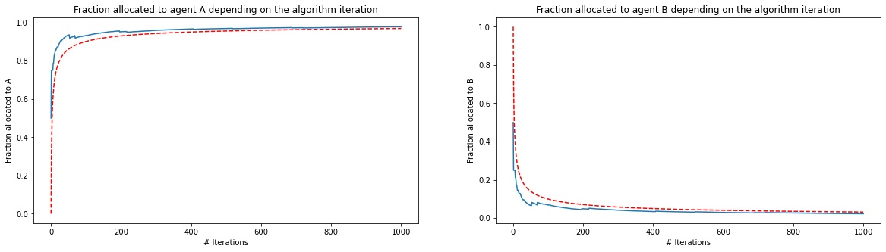

# trustful-bandits

We tackle here the problem of the two armed bandit from a stochastic algorithm standpoint. The goal is to optimize a repartition of capital between two trading agents online. The goal here is to maximize our profits, and thus, asymptotically allocating all our ressources to the best agent.  
We also provide a comprehensive mathematical summary of the two main reference, proving the speed and the convergence of the used algorithm.

Here, we try to match the theoritical results achieved in the paper, apply them with real data and finally try to extend it to a multi-agent setup  

## References: 
<a href='https://arxiv.org/abs/math/0407128v1 '>[1]</a> Can you trust the bandit ? Damien Lamberton, Gilles Pagès and Pierre Tarrès  
<a href='https://arxiv.org/abs/math/0510351'>[2]</a> How fast is the bandit ? Damien Lamberton, Gilles Pagès